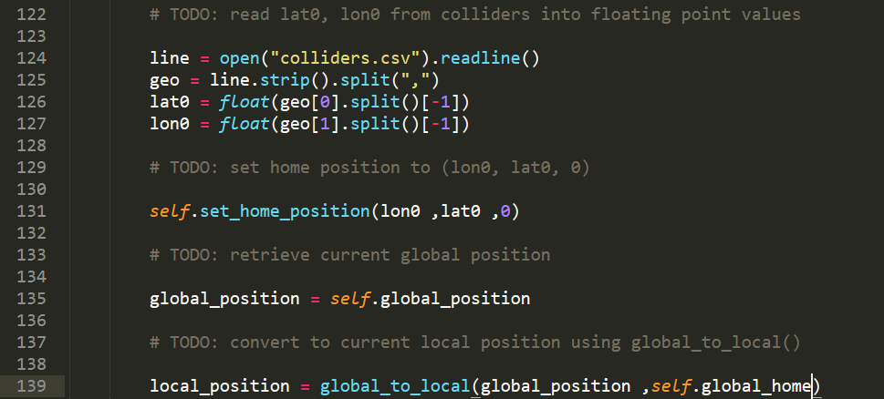
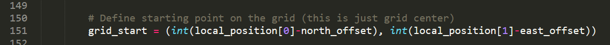

## Project: 3D Motion Planning

---

---
### Writeup 

#### 1. A Writeup that includes all the rubric points and how I overcame each one of them.  

The current writeup.md file that you are reading is my writeup for how i overcame each task. 

### Explain the Starter Code

#### 1. Explain the functionality of what's provided in `motion_planning.py` and `planning_utils.py`

Based on my undertanding of the starter code:

* Initially the Drone takesoff at the center of the map.
* By deafult this is the global home and it is the starting point.
* A path is calculated using A-star algorithm.
* Thus the waypoint is calculated.
* Since the goal is 10 meters north and 10 meters east from the starting point, the drone followed the calculated waypoints and moved in a zig-zag way to reach the goal.

### Implementing Your Path Planning Algorithm

#### 1. Set your global home position
Here students should read the first line of the csv file, extract lat0 and lon0 as floating point values and use the self.set_home_position() method to set global home. Explain briefly how you accomplished this in your code.

* Basically here i have read the colliders.csv file.
* Then obtained the lat0 and lon0 values by parsing it.
* Then the home position is set using the lat0 and lon0 with altitude as 0.

#### The above codes is in the line 124 to 135 in motion_planning.py file

#### 2. Set your current local position

Then global position of the drone was obtained and converted to local position using global_to_local function.

#### The above codes is in the line 135 to 139 in motion_planning.py file

#### 3. Set grid start position from local position

The local position obtained here is with reference to the global home position. Thus added the negative offsets of North and East with the local position.

#### The above codes is in the line 151 in motion_planning.py file

#### 4. Set grid goal position from geodetic coords
This step is to add flexibility to the desired goal location. Should be able to choose any (lat, lon) within the map and have it rendered to a goal location on the grid.

#### 5. Modify A* to include diagonal motion (or replace A* altogether)
Minimal requirement here is to modify the code in planning_utils() to update the A* implementation to include diagonal motions on the grid that have a cost of sqrt(2), but more creative solutions are welcome. Explain the code you used to accomplish this step.

#### 6. Cull waypoints 
For this step you can use a collinearity test or ray tracing method like Bresenham. The idea is simply to prune your path of unnecessary waypoints. Explain the code you used to accomplish this step.

### Execute the flight
#### 1. Does it work?
It works!

### Double check that you've met specifications for each of the [rubric](https://review.udacity.com/#!/rubrics/1534/view) points.
  
# Extra Challenges: Real World Planning

For an extra challenge, consider implementing some of the techniques described in the "Real World Planning" lesson. You could try implementing a vehicle model to take dynamic constraints into account, or implement a replanning method to invoke if you get off course or encounter unexpected obstacles.

